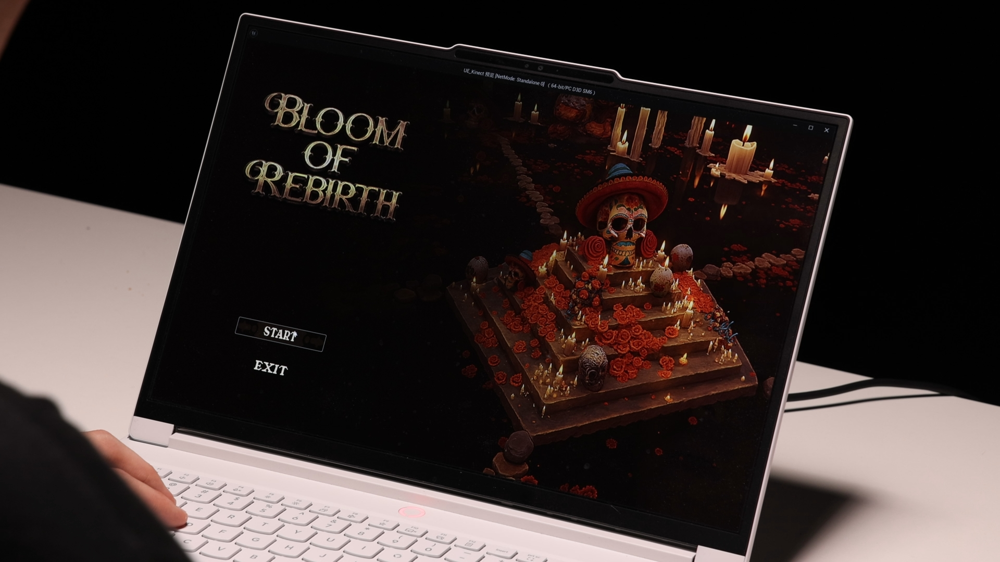

# ChuyaoWang-Project

# 🌸 **Bloom of Rebirth**

| 📄 | Thesis: [**Click to view**](./Docs/Thesis/24009771-ChuyaoWang-How%20can%20remembrance%20and%20death%20be%20explored%20and%20experienced%20in%20digital%20narrative%20storytelling.pdf) |
| -- | :------------------------------------------------------------------------------------------------------------------------------------------------------------------------------------- |

| 🎬 | Demo Video: [**Watch Here**](https://youtu.be/NTWo0wrA_Wg?si=EHeBlgfSNjb-YItW) |
| -- | :--------------------------------------------------------------------------------------- |

| 🎨 | Portfolio: [**Click to view**](./Docs/Portfolio/ChuyaoWang-FinalPortfolio.pdf) |
| --- | :-------------------------------------------------------------------------- |

| 🎮 | Executable Build: [**Download here**](https://drive.google.com/file/d/1iIZDTqto2x7J5ywdzLMQsWzH3DmV9si_/view?usp=drive_link) |
| --- | :-------------------------------------------------------------------------------------------------------------------------------- |

| 🗃️ | Source Files: [**Download Here**](https://drive.google.com/file/d/1hgSwr7IYVelPV9JSZQ1Di-XbsE1l-RB8/view?usp=drive_link) |
| --- | :-------------------------------------------------------------------------------------------------------------------------------------- |

---

# 📚 **Documentation**

| 📘 | **References** — All academic references and cited literature used in the project are located in: 📁 `Docs/References/` |
| -- | :------------------------------------------------------------------------------------------------------------------------- |

| 🧪 | **User Testing Report** — Full testing report, methodology, questionnaire data, and results can be found in: 📁 `Docs/Evaluation/` |
| -- | :------------------------------------------------------------------------------------------------------------------------------------ |

| 📝 | **Participant Consent Forms** — Ethics documentation and participant consent forms are stored in: 📁 `Docs/Evaluation/Participant_Consent_Form` |
| -- | :---------------------------------------------------------------------------------------------------------------------- |

---
# 🧠 **Introduction**

**Bloom of Rebirth** is an interactive two-player experience that explores how death, memory, and digital immortality can be expressed through embodied interaction.
Rather than relying on dialogue or linear storytelling, the project uses **gesture, cooperation, and spatial transition** to construct an emotional journey shared between two players.

In this experience, players take on the roles of the **Living** and the **Departed**, positioned in **two parallel worlds** that cannot directly communicate.
Through Kinect-based body tracking, the Living opens pathways, lifts obstacles, and guides the Departed as they travel through symbolic environments—an altar, a sea of lanterns, the belly of a whale, and the final homecoming.

The project aims to reimagine death not as failure, but as **transformation**.
By inviting players to collaborate through non-verbal actions, Bloom of Rebirth examines how technology can mediate remembrance, presence, and emotional connection within digital spaces.

This repository contains the full project files, development logs, documentation, user testing reports, and evaluation materials.

